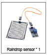
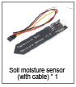

## Raindrop Sensor
A Raindrop Sensor is an electronic module used to detect the presence of rain or water droplets. It is commonly used in  IoT projects for weather monitoring and automation systems.



## How It Works
The sensor operates on the principle of electrical resistance. It is essentially a variable resistor that changes its resistance based on whether it is wet or dry.

**1.The Sensing Pad (The "Grid")**
The large black board with the nickel-plated copper traces is the sensing area.

Dry State: When the board is dry, the traces are not connected. Because air is a poor conductor, the resistance between the tracks is very high.

Wet State: When water drops land on the board, they bridge the gap between the interlaced traces. Since water (especially rainwater with impurities) conducts electricity, it lowers the resistance between the tracks.

**2. The Control Module (The Blue Board)**
The sensing pad connects to this small electronic module, which usually features an LM393 comparator chip. This board does two things:

**Analog Output (AO):** It provides a real-time voltage change based on the amount of water. More water = lower resistance = lower voltage output.

**Digital Output (DO):** It provides a simple `High` or `Low` signal. You can adjust the blue potentiometer (the little screw) to set a "threshold." For example, you can set it so the digital pin only triggers when it’s raining heavily.

|Feature |Value  |
|---------|---------|
|Operating Voltage   | 3.3V – 5V        |
|Output Type    |      Dual (Analog and Digital)   |
|Sensitivity     |       Adjustable via Potentiometer  |

### Typical Pinout

1. **VCC:** Connects to 3.3V or 5V power source.

2. **GND:** Connects to the ground.
   
3. **DO (Digital Output):** High when dry, Low when wet (trigger-based).
   
4. **AO (Analog Output):** Provides a range of values (0 to 1023 on most Arduinos) to measure the intensity of the rain

**Example Code:**

```python
from machine import Pin, ADC, PWM   
from time import sleep

# --- Constants ---
# Pin 26 is a standard ADC (Analog to Digital Converter) pin
RAINDROP_PIN = 26        
# Pin 12 will send a PWM signal to the buzzer to create sound
BUZZER_PIN = 12          

# --- Hardware Setup ---
# Initialize the analog pin to read the voltage from the sensor
Raindrop_AO = ADC(Pin(RAINDROP_PIN))

# Initialize the buzzer using Pulse Width Modulation (PWM) to control frequency
buzzer = PWM(Pin(BUZZER_PIN))
# Set duty cycle to 0 so the buzzer stays quiet on startup
buzzer.duty_u16(0)  

# --- Main Loop ---
while True:
    # Read the raw 16-bit value (range: 0 to 65535)
    # Note: High values = Dry, Low values = Wet
    adc_value = Raindrop_AO.read_u16()
    print("Rain Sensor Value:", adc_value)

    # Threshold Check: If the value drops below 40,000, it means 
    # water is bridging the sensor traces and lowering resistance.
    if adc_value < 40000:
        
        # --- Buzz Alert Sequence ---
        # Set volume/power (duty cycle) to a audible level
        buzzer.duty_u16(1000) 
        
        # Play Note 1 (294Hz - D4) for 0.5 seconds
        buzzer.freq(294)
        sleep(0.5)
        
        # Play Note 2 (495Hz - B4) for 0.5 seconds to create a "siren" effect
        buzzer.freq(495)
        sleep(0.5)
        
    else:
        # If the sensor is dry (value > 40,000), turn off the buzzer
        buzzer.duty_u16(0)
        
        # Wait 1 second before checking again to save power/processing
        sleep(1)
```
## Soil Moisture Sensor

A Soil Moisture Sensor is an electronic device used to measure the amount of water in soil. It is commonly used in:

- Smart irrigation systems

- Smart farms

- Automatic plant watering projects

- Weather & environmental monitoring
  
  

### How It Works: Capacitance
Unlike the raindrop sensor, this sensor does not use the soil as a path for electricity. Instead, it measures capacitance.

**The Dielectric:** The sensor acts like a capacitor. The soil acts as a "dielectric" (an insulating material that can store an electric charge).

**Water Content:** Water has a much higher dielectric constant than air. When the soil gets wet, the capacitance of the sensor increases.

**Internal Circuitry:** The sensor uses an onboard timer (often a 555 timer or similar IC) to create a high-frequency signal. The moisture level in the soil changes the timing of this signal, which the sensor then converts into an Analog Voltage.

**Example Code**
```python
from machine import Pin, ADC, PWM
from time import sleep

# --- Calibration Values (Adjust these based on your tests!) ---
SOIL_DRY = 50000  # ADC value when sensor is in open air
SOIL_WET = 20000  # ADC value when sensor is in a glass of water
RAIN_THRESHOLD = 40000 

# --- Hardware Setup ---
soil_sensor = ADC(Pin(27))     # Capacitive Soil Sensor on GP27
rain_sensor = ADC(Pin(26))     # Raindrop Sensor on GP26
buzzer = PWM(Pin(12))          # Passive Buzzer on GP12
buzzer.duty_u16(0)             # Start silent

def get_moisture_percent(raw_value):
    """Converts raw ADC to a 0-100% scale"""
    # Formula: (Dry - Current) / (Dry - Wet) * 100
    percentage = (SOIL_DRY - raw_value) * 100 / (SOIL_DRY - SOIL_WET)
    
    # Keep result between 0 and 100
    return max(0, min(100, round(percentage)))

while True:
    # 1. Read Sensors
    rain_val = rain_sensor.read_u16()
    soil_val = soil_sensor.read_u16()
    
    # 2. Process Data
    moisture = get_moisture_percent(soil_val)
    is_raining = rain_val < RAIN_THRESHOLD
    
    # 3. Print Results
    print("-" * 20)
    print(f"Soil Moisture: {moisture}%")
    print(f"Rain Status: {'RAINING!' if is_raining else 'Clear'}")

    # 4. Alarm Logic
    if is_raining:
        # High-pitched rapid beep for rain
        buzzer.duty_u16(2000)
        buzzer.freq(1000)
        sleep(0.1)
        buzzer.duty_u16(0)
        sleep(0.1)
    elif moisture < 20:
        # Low-pitched slow beep for dry soil
        buzzer.duty_u16(1000)
        buzzer.freq(440)
        sleep(0.5)
        buzzer.duty_u16(0)
    
    sleep(1) # Wait before next reading
```