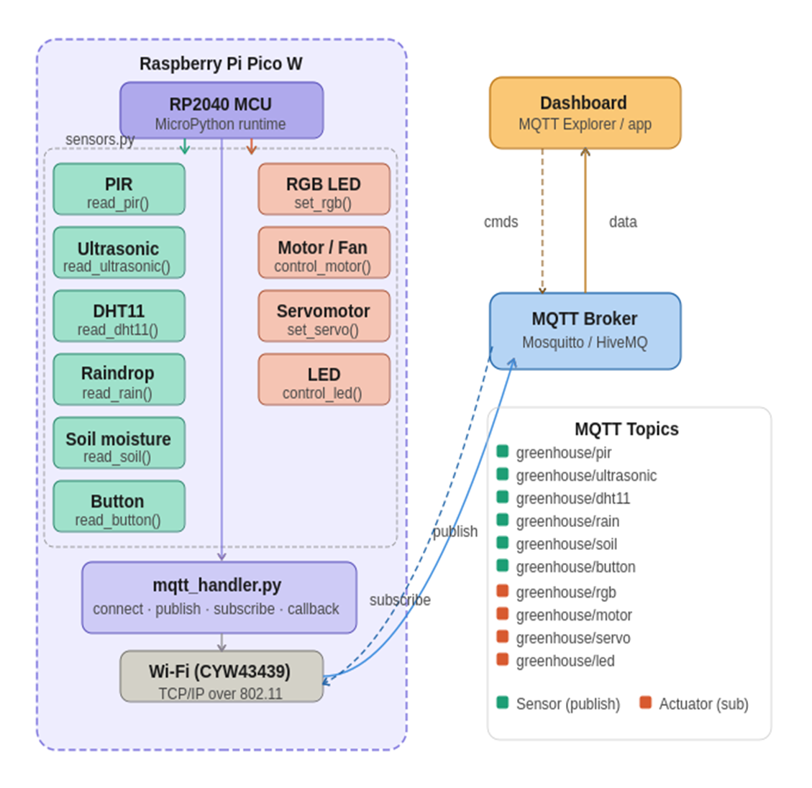

# MicroPython & MQTT
## Smart Greenhouse Monitoring System
### Scenario
You have been hired by GreenFuture Farms to build an automated smart greenhouse monitoring and control system using a Raspberry Pi Pico. The greenhouse grows a variety of crops that need constant care, and the farm manager needs real-time data and remote control from a central MQTT dashboard.

The system must monitor environmental conditions, detect intruders, control irrigation and ventilation, and respond to manual overrides — all over MQTT. Your Raspberry Pi Pico will act as the primary IoT node, publishing sensor readings and subscribing to control commands.
 ## 1. System Context
 - The greenhouse operates 24/7 and relies on automated decisions triggered by sensor data.
 - A remote MQTT broker (e.g., Mosquitto) acts as the central hub.
 - A dashboard application subscribes to all sensor topics and publishes control commands.
 - Your Pico must handle all 10 sensors/actuators and communicate every reading/event over MQTT.
## 2. Operational Requirements
1.	Detect unauthorised entry using a PIR sensor and publish an alert.
2.	Measure distance to objects (e.g., water level in a tank) using an Ultrasonic sensor.
3.	Indicate system status visually using an RGB LED.
4.	Monitor temperature and humidity using a DHT11 sensor.
5.	Control greenhouse ventilation with a DC Motor / Fan based on temperature.
6.	Detect rainfall to automatically close vents using a Raindrop sensor.
7.	Monitor soil moisture and trigger irrigation when dry using a Soil Moisture sensor.
8.	Control vent angles precisely using a Servomotor.
9.	Allow manual override of any system via a physical Button.
10.	Provide visual feedback for alerts and states via an LED.

## 3. System Architecture

### 4. Hardware Requirements
- Raspberry Pi Pico
- PIR Motion Sensor
- Ultrasonic Distance Sensor
- RGB LED
- DHT11 Temperature and Humidity Sensor
- DC Motor / Fan
- Raindrop Sensor
- Soil Moisture Sensor
- Servomotor
- Push Button
- MQTT Broker (e.g., Hivemq)
- Power Supply
- Jumper Wires
- Breadboard

## Sensors & Actuators

| Sensor / Component|MQTT Topic |Function Name |Description |
|---------|---------|---------|---------|
|RPIR Motion Sensor      | greenhouse/pir | read_pir() | Detects motion / intruders |
|Ultrasonic Sensor          | greenhouse/ultrasonic | read_ultrasonic() | Measures distance in cm |
|RGB LED     | greenhouse/rgb | set_rgb(r, g, b) | Status indicator light |
|DHT11     | greenhouse/dht11 | read_dht11() | Temp (°C) and humidity (%) |
|DC Motor     | greenhouse/motor | control_motor(speed) | Ventilation fan control |
|Raindrop Sensor     | greenhouse/rain | read_rain() | Detects rain / moisture on surface |
|Soil Moisture Sensor     | greenhouse/soil | read_soil() | Soil moisture percentage |
|Servomotor     | greenhouse/servo | set_servo(angle) | Vent angle 0°–180° |
|Push Button     | greenhouse/button | read_button() | Manual override trigger |
|LED     | greenhouse/led | control_led(state) | Alert / status indicator |

## 5. Project Structure
Organize your project files as follows:
```greenhouse_mqtt/
├── main.py            # Entry point – connects Wi-Fi & MQTT, starts main loop
├── config.py          # Wi-Fi credentials, broker IP, topics
├── sensors.py         # All 10 sensor/actuator functions
└── mqtt_handler.py    # MQTT connect, publish, subscribe, callback

```
## 6. Logic Requirements
In addition to publishing raw sensor data, your main loop must implement the following automatic control logic. Each rule should be triggered locally on the Pico — do not wait for MQTT commands for these.

### Rule 1 — Intruder Alert
- If PIR detects motion → publish alert to greenhouse/pir
- Set RGB LED to RED (1, 0, 0) and turn LED on
- Publish alert message: 'INTRUDER DETECTED' to greenhouse/alert
### Rule 2 — Temperature-Based Ventilation
- If DHT11 temperature > 30°C → set motor to 100% speed, set servo to 90° (vents open)
- If temperature between 25–30°C → set motor to 50% speed, set servo to 45°
- If temperature < 25°C → set motor to 0% (off), set servo to 0° (vents closed)
- Set RGB LED to BLUE (0, 0, 1) when ventilation is active

### Rule 3 — Rain Detection
- If raindrop sensor detects rain (ADC value < 20000) → set servo to 0° (close vents)
- Turn on LED as rain indicator
- Publish 'RAIN DETECTED — VENTS CLOSED' to greenhouse/alert

### Rule 4 — Irrigation Control
- If soil moisture ADC value > 40000 (dry) → publish 'IRRIGATION NEEDED' to greenhouse/alert
- Set RGB LED to GREEN (0, 1, 0) while irrigation is needed

### Rule 5 — Manual Override Button
- When button is pressed → toggle the fan motor between 0% and 100%
- Publish 'MANUAL OVERRIDE ACTIVATED' to greenhouse/button
- Flash LED 3 times to confirm override

### Rule 6 — Water Tank Level
- If ultrasonic sensor reads distance > 20 cm → publish 'WATER TANK LOW' to greenhouse/alert
- If distance < 5 cm → publish 'WATER TANK FULL' to greenhouse/ultrasonic
###  7. MQTT Topic References
Use the following topics exactly as shown. The broker, dashboard, and marking will rely on these exact topic strings.

|Topic |Direction  |Payload Example |Trigger  |
|---------|---------|---------|---------|
|greenhouse/pir    |   Publish      | {"motion": true}        | Every PIR state change        |
|greenhouse/ultrasonic     |    Publish     | {"distance": 12.5} |  Every reading cycle       |
|greenhouse/rgb     |  Subscribe     |{"r":1,"g":0,"b":0}         |  Remote colour command       |
|greenhouse/dht11     |  Publish       | {"temp":28.5,"hum":62}        |   Every reading cycle      |
|greenhouse/motor     |    Both     |    {"speed": 75}     |   Publish state; subscribe cmd      |
|greenhouse/rain     |    Publish     | {"rain": true} |    Every reading cycle     |
|greenhouse/soil     |  Publish       | {"moisture": 45000} |      Every reading cycle   |
|greenhouse/servo     |  Both    | {"angle": 90} |   Publish state; subscribe cmd      |
|greenhouse/button     |  Publish    | {"pressed": true} |      On button press event   |
|greenhouse/led     |  Both    | {"state": true} |   Publish state; subscribe cmd      |
|greenhouse/alert     |  Publish    | "INTRUDER DETECTED"        |     On any alert condition    |

**Tip:** Use the json module (import ujson) to encode and decode all payloads. Publish formatted strings: ujson.dumps({'temp': temp, 'hum': hum})

